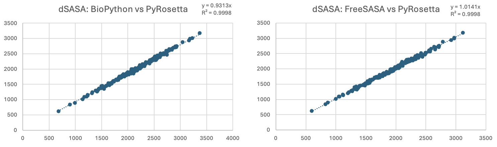
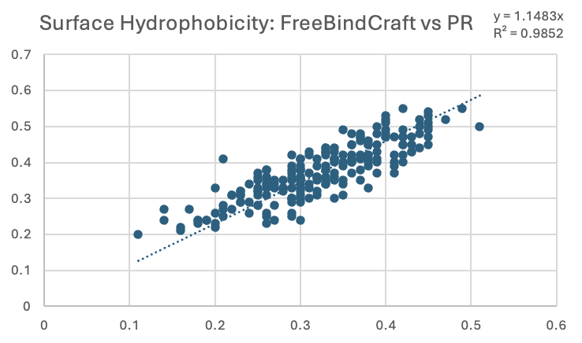
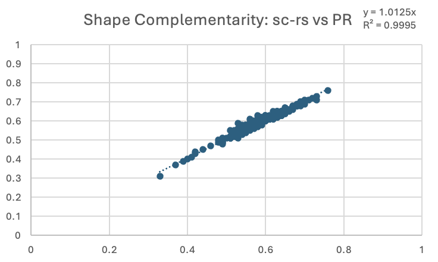

## FreeBindCraft Technical Overview

### Purpose

FreeBindCraft provides an optional PyRosetta bypass for the BindCraft pipeline so that teams can design binders end-to-end using only open-source components. This document explains the motivation, summarizes what changes in bypass mode, and details how key PyRosetta features were replaced or reinterpreted with OpenMM, FreeSASA, Biopython, and a standalone shape-complementarity tool.

References:
- Original BindCraft: [https://github.com/martinpacesa/BindCraft](https://github.com/martinpacesa/BindCraft)
- FreeBindCraft fork: [https://github.com/cytokineking/FreeBindCraft](https://github.com/cytokineking/FreeBindCraft)


### Motivation and context

BindCraft is a state-of-the-art, open pipeline for de novo miniprotein design that combines AlphaFold2/ColabDesign for structure-guided sequence generation with ProteinMPNN for sequence optimization. In the original pipeline, PyRosetta is used only in the final scoring step (relaxation plus several interface metrics).

However, PyRosetta itself is not open source and requires a commercial license for non-academic use (see Rosetta Commons licensing FAQ: [https://rosettacommons.org/software/licensing-faq/](https://rosettacommons.org/software/licensing-faq/)). This creates friction for commercial users and for SaaS-like deployments. Our goal with FreeBindCraft is to remove these barriers by:
- Providing a full open-source path through the pipeline ("--no-pyrosetta").
- Preserving the scientific intent of key metrics with practical open alternatives.
- Maintaining output quality and filter behavior where it matters most.


### High-level changes in bypass mode

When the `--no-pyrosetta` flag is used at install or runtime, FreeBindCraft switches the following components:

- Relaxation: PyRosetta FastRelax → OpenMM-based relax (GPU-accelerated)
- SASA and surface metrics: PyRosetta metrics → FreeSASA (preferred) or Biopython fallback
- Shape complementarity (SC): PyRosetta SC → `sc-rs` CLI (Rust, MIT-licensed)
- Structural alignment and RMSDs: PyRosetta → Biopython-based alignment and RMSD
- Interface energetics and some Rosetta-specific metrics: not recomputed; conservative placeholders used where needed to preserve CSV schemas and not block filters

Where possible, we validated replacements against PyRosetta-derived values. For metrics that did not materially affect accept/reject decisions in our empirical analysis, we prioritized a stable, transparent approximation over re-implementing complex internals.


## Empirical impact: what actually drives rejections

We analyzed roughly 20,000 trajectories and ~400,000 MPNN sequence variants across runs to quantify which filters determine acceptance. Highlights:

- ~88.65% of MPNN variants fail base AlphaFold metrics and are rejected before any PyRosetta scoring is involved.
- An additional ~1.63% of MPNN variants violate additional AlphaFold metrics, yielding a total of >90% of rejections being driven by AlphaFold metrics alone.
- Structural agreement checks (e.g., hotspot/binder RMSDs): ~1.66% of rejections.
- Interface amino acid composition (e.g., excessive Lys or Met residues) accounted for ~0.20 of rejections.
- Surface hydrophobicity: ~3.89% of rejections.
- Shape complementarity (SC): ~0.74% of rejections.
- Hydrogen-bond network quality (mostly “unsatisfied H-bonds”): ~3.23% of rejections.
- Interface energetic/size thresholds (e.g., dG, dSASA) were negligible drivers (only one observed rejection across these runs).

These observations guided which features we fully re-implemented, approximated, or deprioritized. The analysis workflow is codified in `extras/analyze_bindcraft_rejections.py`, which can be run on one or many result folders to reproduce breakdowns.

Example (non-recursive, default filters in current directory):
```bash
python extras/analyze_bindcraft_rejections.py \
  --input-dir /path/to/run_folder \
  --filter-mode default
```


## Implementation details

### OpenMM relaxation (replaces PyRosetta FastRelax)

Why it matters: Relaxation resolves steric clashes and poor local geometries before interface scoring. Without this step, metrics like SC and dSASA can be distorted by minor atom overlaps rather than true interface quality.

File: `functions/pr_alternative_utils.py`

- Preparation: PDBFixer removes heterogens, adds missing atoms/hydrogens.
- Force field: Amber14 with OBC2 implicit solvent.
- Backbone heavy-atom restraints: harmonic restraints ramped down across stages.
- Additional short-range repulsion: a custom nonbonded repulsive term (r^−12-like) ramped up across stages to resolve early clashes.
- Optional short MD “shakes”: applied to the first two stages to help escape poor contacts.
- Minimization: chunked L-BFGS stages with early-stopping on negligible energy improvement; accept-to-best bookkeeping across stages.
- Post-processing: align all-CA to input, copy original B-factors, and clean PDB records.
- Platform selection: prefers GPU via OpenCL; runs via a subprocess helper with retries to ensure clean driver/runtime teardown between designs.

Expected behavior: OpenMM relax is typically 2–4× faster than CPU FastRelax, and sufficient for the pipeline’s goal of removing clashes prior to interface scoring. It intentionally limits backbone drift to respect AlphaFold predictions.


### SASA, interface size, and surface hydrophobicity

Files: `functions/pr_alternative_utils.py`, `functions/biopython_utils.py`

- Why it matters: Interface size (dSASA) and the hydrophobic/hydrophilic balance at the binder surface influence stability, solubility, and specificity. Excessive surface hydrophobicity correlates with aggregation and promiscuous binding, while insufficient buried area may correlate with weak affinity.

- SASA engine: prefers FreeSASA; falls back to Biopython Shrake–Rupley. A NACCESS-style classifier config is bundled for FreeSASA.
- Interface dSASA: computed as monomer SASA minus complex SASA for binder and target, summed.
- Interface SASA fraction: total interface dSASA normalized by binder SASA within the complex.

- Surface hydrophobicity (binder): fraction of total binder SASA contributed by hydrophobic residues (A, C, F, I, L, M, P, V, W, Y). This area-weighted definition:
  - Avoids binary “exposed vs buried” thresholds (which can be brittle at boundaries).
  - Naturally down-weights partially buried residues and up-weights fully exposed residues.
  - Weighs large aromatics (W/F/Y) more than small aliphatics (A/V) in proportion to their actual surface exposure.

Comparison to original BindCraft (Rosetta layer-based exposure):
- The original approach classifies residues as “surface-exposed” or not, then computes the fraction of those residues that are hydrophobic. This binarizes exposure and treats all hydrophobics equally.
- Our area-based method produces values that correlate with the original but differ in interpretable ways: sequences rich in large aromatics or with partially buried hydrophobics may receive higher or lower scores reflecting their true SASA contributions.
- Practically, we observed close alignment between FreeSASA-derived hydrophobicity and PyRosetta-based results, with small dispersion attributable to the different exposure model (continuous area vs binary layer) and minor SASA engine differences.

Notes: FreeSASA agrees closely with PyRosetta SASA; Biopython values are slightly higher on average. The hydrophobicity definition here is intentionally area-weighted. It correlates with—though is not identical to—the original Rosetta layer-based approach and we consider it more faithful to the physical notion of “hydrophobic surface area”.

<p align="center">
  
</p>
<p align="center"><em>dSASA comparisons: Biopython (left) and FreeSASA (right) versus PyRosetta.</em></p>

<p align="center">
  
</p>
<p align="center"><em>Surface hydrophobicity: area-weighted SASA (FreeBindCraft) vs Rosetta layer‑based exposure.</em></p>

### Shape complementarity (SC)

File: `functions/pr_alternative_utils.py`

- Why it matters: SC quantifies the geometric fit of two interfaces (0–1). Higher SC often correlates with tighter, more specific binding and fewer steric voids.

- Tool: `sc-rs` CLI (MIT license) computes the Lawrence & Colman SC statistic in [0, 1].
- Integration: looks for a binary next to `functions/` (e.g., `functions/sc`), then environment variables (`SC_RS_BIN`, `SC_BIN`), then `PATH`.
- Agreement: empirical comparisons show near-identical values to PyRosetta with minor differences likely from radii/surface discretization.

<p align="center">
  
</p>
<p align="center"><em>Shape complementarity comparison: sc-rs versus PyRosetta.</em></p>


### Interface residues, composition, and structural checks

Files: `functions/biopython_utils.py`, `functions/pyrosetta_utils.py`

- Why it matters: Interface residue identity and density (and structural agreement with intended hotspots) are basic sanity checks for binding-mode fidelity. RMSDs help ensure the binder remains in the designed site.

- Interface residues: identified by KD-tree neighbor search between binder and target heavy atoms within 4.0 Å.
- Interface amino-acid composition: per-residue counts over the detected interface residues.
- Alignment and RMSDs: Biopython-based alignment (CA atoms) and unaligned RMSD for hotspot and binder comparisons.


### Metrics not recomputed without PyRosetta

Some Rosetta-native metrics are not reproduced in bypass mode due to complexity and limited impact on accept/reject decisions in our analysis:

- Energetics (e.g., `dG`, `Binder_Energy_Score`)
  - Why they matter: Interface energetics are useful for post hoc interpretation, but our analyses show they rarely act as the deciding filter thresholds within BindCraft’s default settings (~1:400,000 rejections).
  - Rationale for omission: Robust, general-purpose open re-implementations would require nontrivial modeling choices; given negligible impact on pass/fail decisions, we prefer transparency and speed.

- Buried unsatisfied hydrogen bonds (i.e., the absence of an H-bond when an H-bond donor/acceptor is present) and related network measures
  - Why they matter: In tightly-packed, hydrophobic protein cores, unsatisfied H-bond donors/acceptors are highly energetically unfavorable and often signal structural issues.
  - Why we omitted in FreeBindCraft: Protein–protein interfaces are more solvent exposed and less hydrophobic than protein cores. Implicit/explicit solvent can satisfy many potential donors/acceptors, making the “unsatisfied” call subjective and model-dependent. Burial estimation itself is noisy at interfaces.

For schema compatibility, placeholders are emitted that satisfy default thresholds but should not be interpreted as true physical values. If your workflow critically depends on these, run with PyRosetta enabled.


## Limitations and guidance

- Experimental validation directly comparing FreeBindCraft bypass mode to PyRosetta-inclusive runs has not yet been conducted; the wet‑lab impact of scoring modifications is TBD.
- SC and SASA metrics may differ slightly from Rosetta due to surface generation and radii models; these differences were small and not outcome-driving in our tests.
- The OpenMM relax focuses on clash resolution with minimal backbone drift. If your downstream workflow requires full Rosetta refinement for energetic analysis, consider enabling PyRosetta for those specific steps.


## Performance and operational notes

- The relaxation runs in a fresh subprocess per design to avoid long-run GPU driver/runtime state accumulation.
- File-descriptor and DSSP caching safeguards are in place to support high-throughput runs (see `extras/BUGFIX_FILE_DESCRIPTORS.md`).
- Overall pipeline throughput improves as more MPNN candidates are accepted given H-bond network evaluation is omitted in bypass mode (exact speedups TBD).


## Reproducing the rejection analysis

Script: `extras/analyze_bindcraft_rejections.py`

Outputs:
- `rejection_breakdown.csv`: fractions of rejections attributed to each filter family.
- `annotated_rejections.csv`: row-wise flags indicating which filters were responsible.

Examples:
```bash
# Default/relaxed filters JSON expected in current working directory
python extras/analyze_bindcraft_rejections.py --input-dir /path/to/runs --filter-mode default

# Use the Filters column recorded per-run (design-mode)
python extras/analyze_bindcraft_rejections.py --input-dir /path/to/runs --filter-mode design
```
